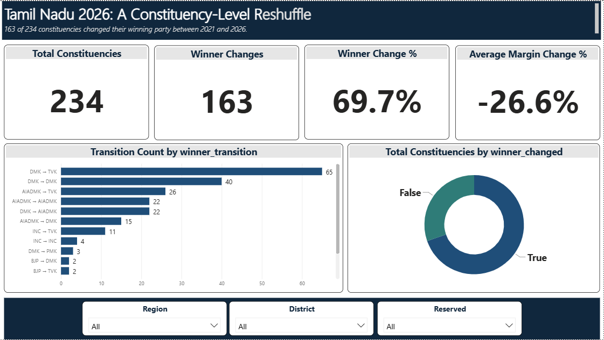
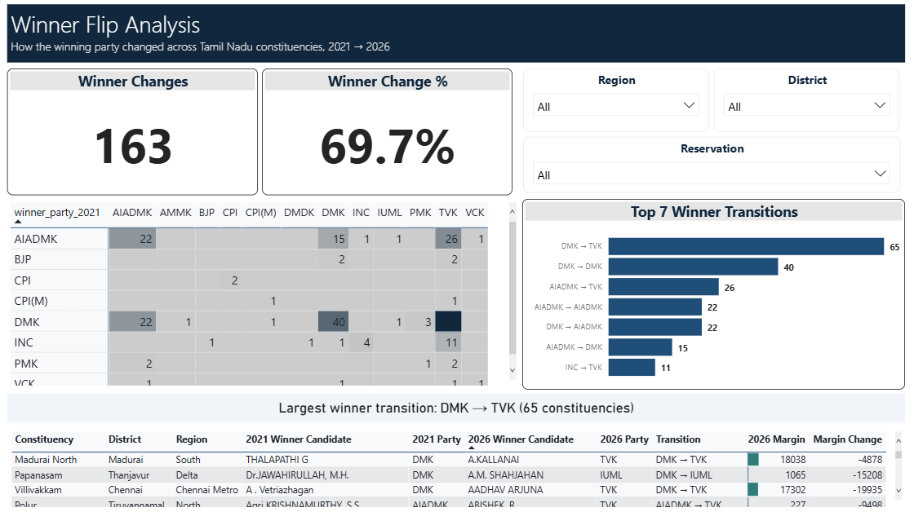
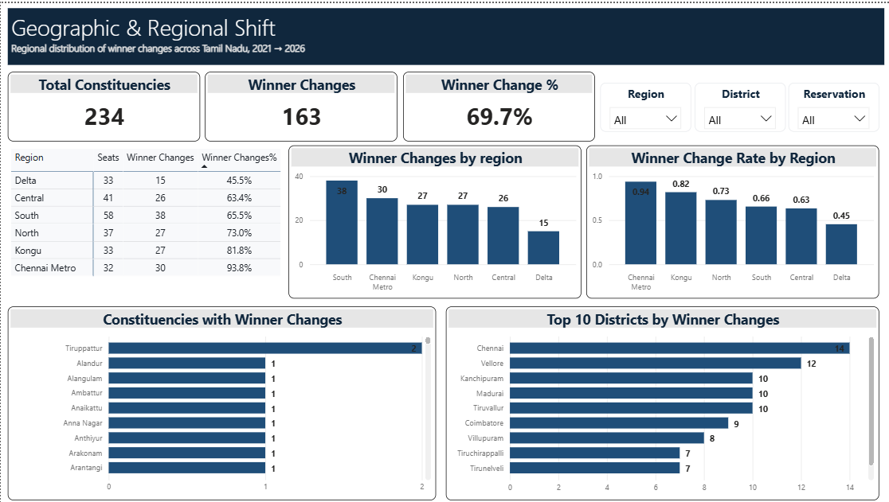
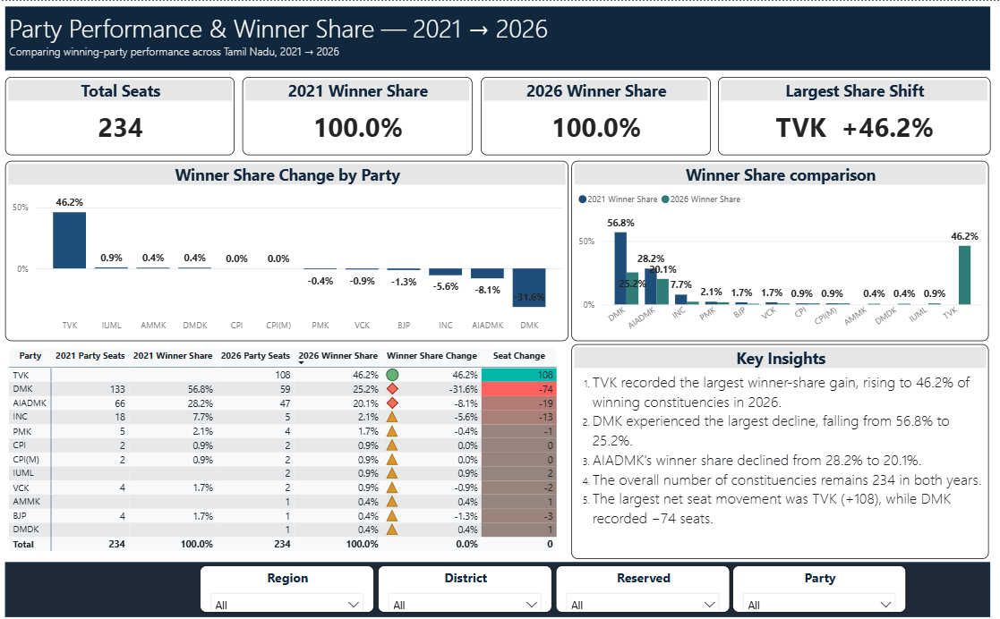
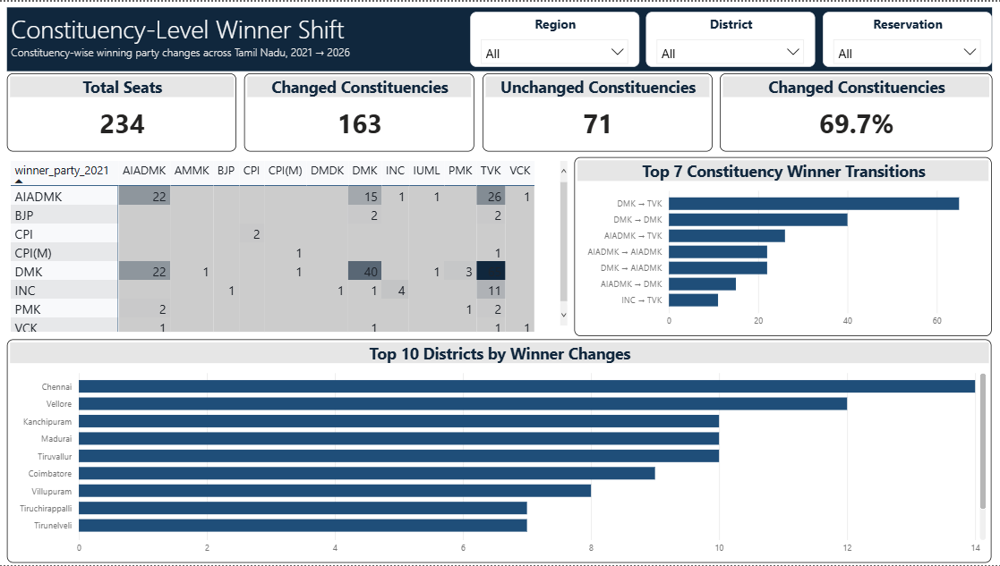
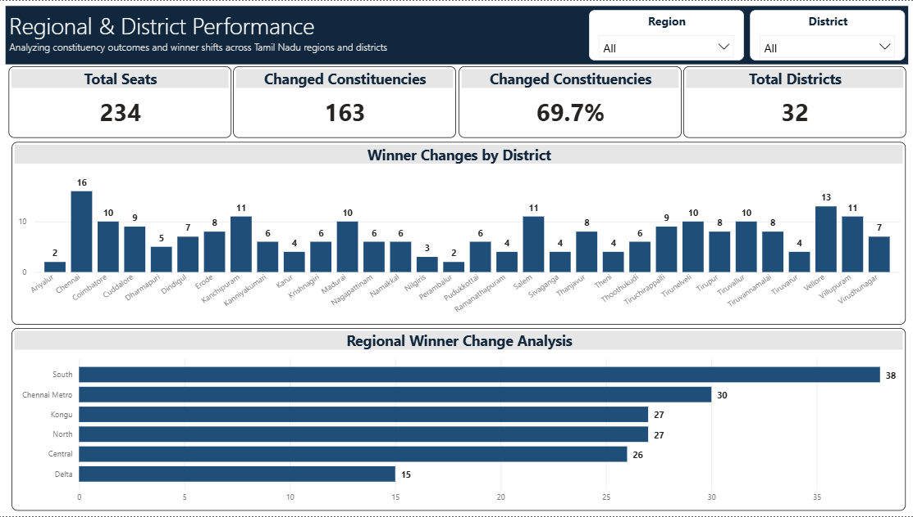
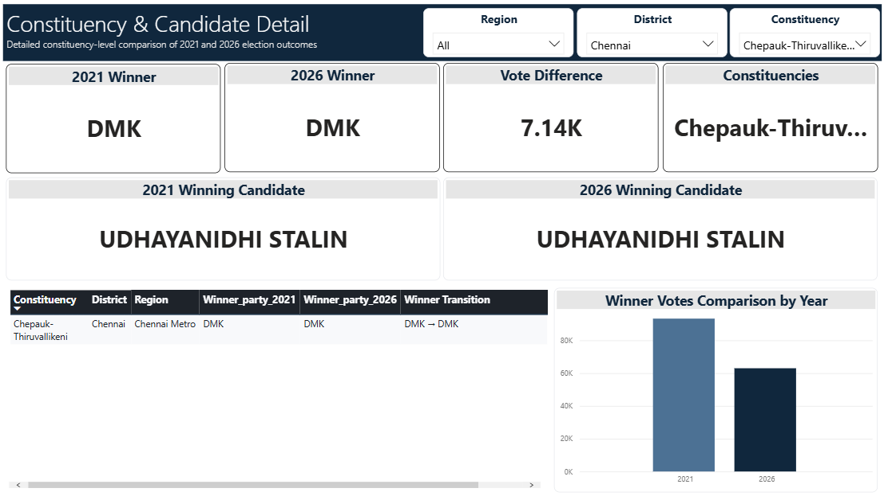
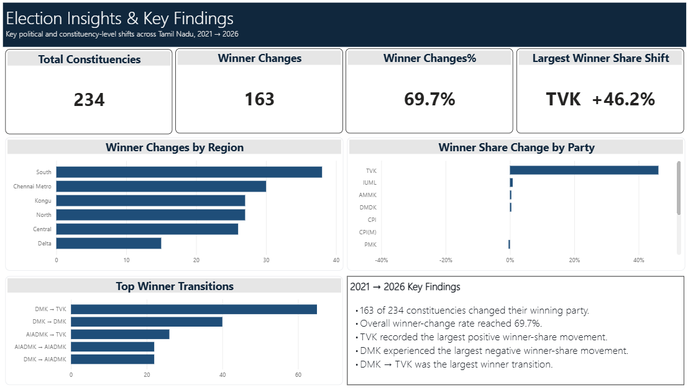

# 🇮🇳 Tamil Nadu Election 2021 → 2026 | Power BI Analytics Dashboard

An interactive **Power BI analytics project** presenting constituency-level analysis of Tamil Nadu Assembly election results, comparing winning-party outcomes between **2021 and 2026**.

The dashboard focuses on winner transitions, party performance, winner share, regional shifts, district-level patterns, and constituency-level comparisons.

> **Disclaimer:** This is an independent data analytics and visualization project. It is not affiliated with, endorsed by, or officially associated with the Election Commission of India, Tamil Nadu election authorities, any political party, candidate, or political organization.

---

## 📊 Project Overview

The dashboard analyses all **234 Tamil Nadu Assembly constituencies** and provides an interactive comparison between the 2021 and 2026 election outcomes.

### Key Analysis Areas

* Constituency-level winner changes
* 2021 vs 2026 winning-party comparison
* Party-wise winning seats
* Winner Share comparison
* Winner Share Change
* Seat Change
* Regional winner changes
* District-level winner transitions
* Constituency-level winner transitions
* Winning candidate comparison
* Winner vote comparison
* Vote Difference / Vote Margin analysis

---

## 📑 Dashboard Pages

### 1. Election Overview

High-level overview of constituency-level winner changes across Tamil Nadu.

### 2. Winner Flip Analysis

Analysis of constituencies where the winning party changed between 2021 and 2026.

### 3. Geographic & Regional Shift

Regional distribution of winner changes across:

* Chennai Metro
* Kongu
* North
* South
* Central
* Delta

### 4. Party Performance & Winner Share

Comparison of:

* 2021 Party Seats
* 2021 Winner Share
* 2026 Party Seats
* 2026 Winner Share
* Winner Share Change
* Seat Change

### 5. Constituency-Level Winner Shift

Detailed analysis of constituency-level changes in winning parties.

### 6. Regional & District Performance

Comparison of winner changes across Tamil Nadu regions and districts.

### 7. Constituency & Candidate Detail

Interactive constituency-level comparison including:

* 2021 Winner
* 2026 Winner
* 2021 Winning Candidate
* 2026 Winning Candidate
* Vote Difference
* Winner Transition

### 8. Election Insights

Summary of key patterns and observations identified from the dashboard analysis.

---

## 🖼️ Dashboard Preview

### Page 1 — Election Overview

### Page 2 — Winner Flip Analysis

### Page 3 — Geographic & Regional Shift

### Page 4 — Party Performance & Winner Share

### Page 5 — Constituency-Level Winner Shift

### Page 6 — Regional & District Performance

### Page 7 — Constituency & Candidate Detail

### Page 8 — Election Insights

---

## 🧮 Power BI & DAX

The project uses Microsoft Power BI for data modelling, calculations and visualization.

### DAX Concepts Used

* `CALCULATE`
* `DISTINCTCOUNT`
* `VALUES`
* `TREATAS`
* `SELECTEDVALUE`
* `SWITCH`
* Dynamic measures
* Filter context
* Party-wise calculations
* Winner transition calculations
* Seat change calculations
* Winner Share calculations
* Regional and district analysis

---

## 🎨 Power BI Theme

A neutral election-focused Power BI theme has been created for this project.

The theme uses a professional combination of:

* Deep navy
* White
* Neutral grey
* Saffron-inspired accent
* Green-inspired accent

The design is intended to provide a public-election-data visual style while maintaining a neutral analytical presentation.

### Theme File

`TN_Assembly_Neutral_Theme.json`

> The theme is an independent visual design and should not be interpreted as an official Election Commission of India theme or branding.

---

## 📂 Repository Contents

| File                                                | Description           |
| --------------------------------------------------- | --------------------- |
| `Dashboard - Tamilnadu Election Result - 2026.pbix` | Power BI dashboard    |
| `TN_Assembly_Neutral_Theme.json`                    | Power BI report theme |
| `1.png`                                             | Dashboard Page 1      |
| `2.png`                                             | Dashboard Page 2      |
| `3.png`                                             | Dashboard Page 3      |
| `4.png`                                             | Dashboard Page 4      |
| `5.png`                                             | Dashboard Page 5      |
| `6.png`                                             | Dashboard Page 6      |
| `7.png`                                             | Dashboard Page 7      |
| `8.png`                                             | Dashboard Page 8      |

---

## 🔎 Analytical Perspective

This project is designed to explore constituency-level electoral patterns rather than provide political predictions.

The analysis focuses on questions such as:

* Which constituencies experienced a winner change?
* Which regions recorded higher levels of winner transition?
* Which parties gained or lost winning seats?
* How did Winner Share change between 2021 and 2026?
* Which districts experienced significant winner transitions?
* How did winning candidates change at constituency level?
* What was the vote difference between the winning outcomes being compared?

---

## ⚠️ Important Interpretation

This dashboard primarily analyses **winning-party outcomes at constituency level**.

Party-level results should not automatically be interpreted as alliance-level performance because political alliances and party relationships can change between election periods.

The dashboard therefore presents constituency and party-level observations separately from alliance-level interpretation.

---

## 🛠️ Technologies

* **Microsoft Power BI**
* **DAX**
* **Power Query**
* **Data Modelling**
* **Data Visualization**

---

## 👤 Author

**SathikAboortheen**

Power BI | DAX | Data Analytics | Data Visualization

---

## ⭐ Feedback

If you find this project useful, feel free to **star ⭐ the repository** and share your feedback or suggestions.

This project is intended as a portfolio demonstration of Power BI dashboard development, DAX calculations, data modelling and election-data visualization.
